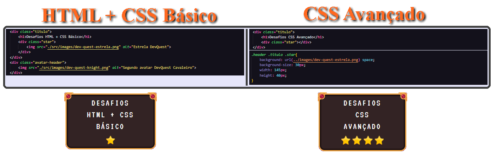
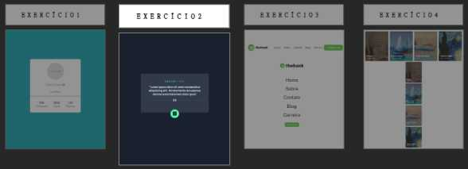
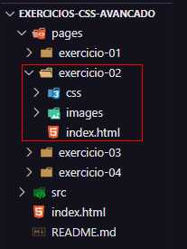
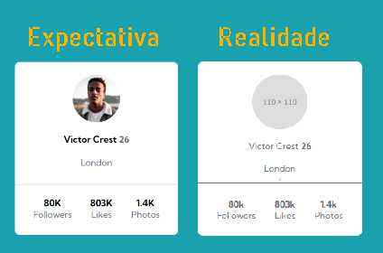

# 🧙‍♂️ Exercícios do curso DevQuest 2 🧙‍♂️
Segunda landing page, agora com links para as páginas dos exercícios de css avançado.

## Exercícios de CSS Avançado do curso DevQuest
Aqui estão presentes os 4 exercícios apresentados no meio do curso para CSS, utilizando o Flexbox.

## 🛠 Tecnologias e Sites Utilizados 🛠
- VS Code // (*escrever o código*)
- RealWorld Paint // (*criação de imagens svg*)

## 🧩 A Página 🧩
A primeira diferença entre essa landing page e a do exercícios básicos, é o fato da estrela no texto do cabeçalho usar o **background**, em uma div vazia, invés de uma tag img;

---

Para as imagens no main, pelo fato da explicação dos exercícios estarem no figma ou em uma página do notion, não tinha como pegar o pdf e transformar em svg, como fiz na página para html + css básico;

Isso me fez criar um design simples no *RealWorldPaint*, usando vetores e colocando um print de toda página como conteúdo, para então salvar como svg;

De resto, pude utilizar o código da página feito anteriormente bem tranquilo;

---

A outra mudança foi na organização das pastas. Basicamente coloquei todos exercícios em suas pastas, invés de colocar o html na página */pages* e os seus css na pasta *src/css*;

Isso fez a "transição" das pastas originais dos exercícios pra esse projeto "hub", bem mais fácil, além de que não precisei mudar o código link styles.css do html deles para o src main, como fiz no html+css básico;

🤔 *Tem algo me bugando muito na frase anterior, mas não consigo corrigi-lá, sadness.*

## 🤓 Os Exercícios 🤓
A maioria dos desafios teve uma pequena reformulação no código,  mas tentei manter o máximo possível do que fiz originalmente para futuras referências.

### Exercício 1 - Cartão de Perfil
Infelizmente, ao realizar o desafio, o link do zip para o projeto estava quebrado, então fiquei sem os links das imagens e arquivos, me restando simplesmente a referência e os dados no notion;

Ver como fiz o código é meio triste... Mas isso mostra que hoje em dia entendo um pouco mais de como escrevê-lo e consigo ver os erros claramente;

---
### Exercício 2 - Tela de Dicas Aleatórias
Outro exercício com os links quebrados quando fiz ele pela primeira vez.

Só que esse estava tão ruim que, quando os links foram consertados, tive que dar uma mudada no código e nas imagens, pelo menos para ficar melhor visualmente;

---
### Exercício 3 - Menu Header
Fazer o código foi complicado, por algum motivo, mas conseguir entendê-lo no final foi uma boa recompensa;

Ele é bem simples, com um simples flexbox row e column, pro mobile, nada de mais;

---
### Exercício 4 - Imagens com texto sobreposto
Esse foi uma vergonha. Minha primeira tentativa foi fazer o "mobile-first", aí inventei um flex-direction column e, quando a tela ficava grande, eu usava um media query pra row 🧠...

Tudo isso pra ver a resolução e perceber que um simples flex-wrap já resolvia tudo, sem precisar de media queries 🙃. É aquele tipo de experiência que te marca bem forte.

## 🔥 Bora Pra Mais 🔥
O legal de tudo é que eu consigo fazer essas coisas bem simples hoje em dia, então tá valendo a pena.

Até a próxima!